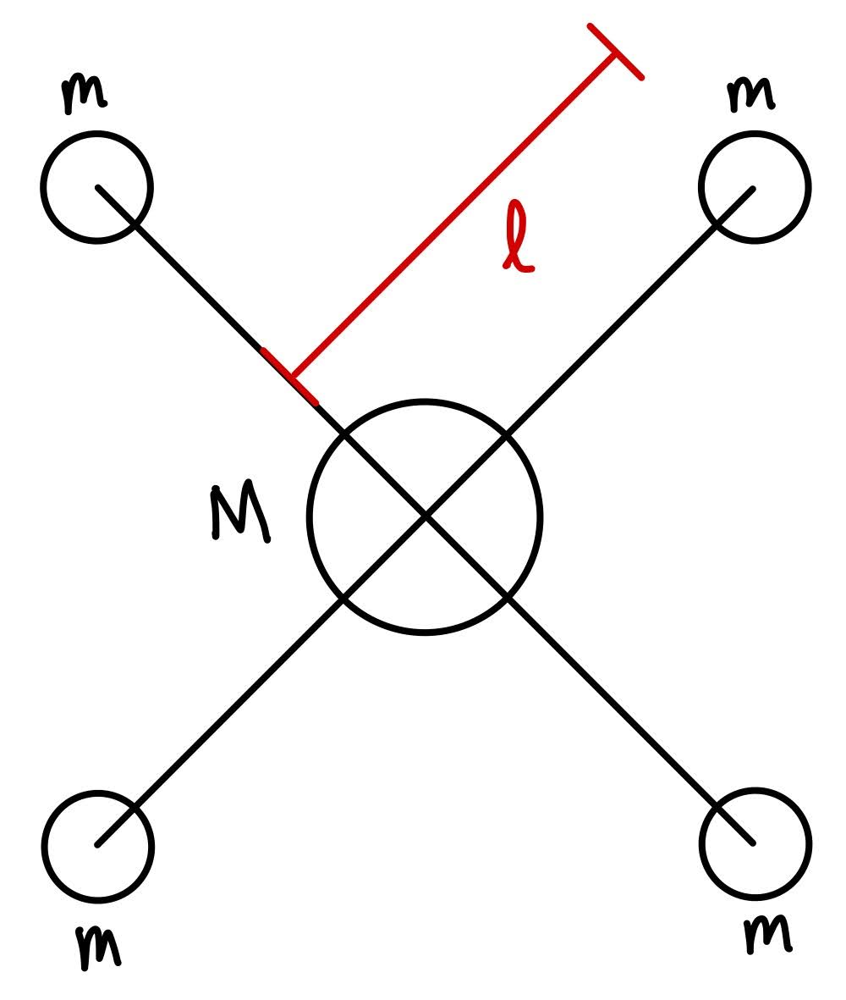
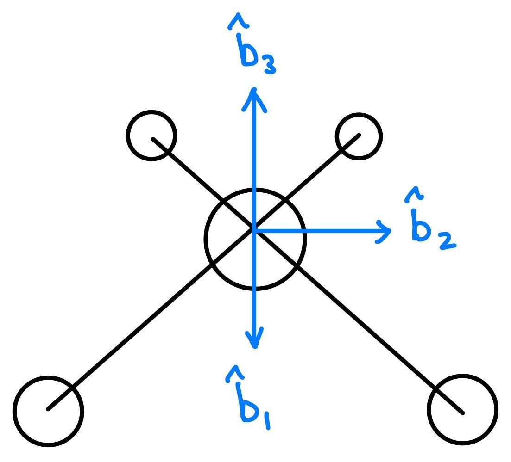
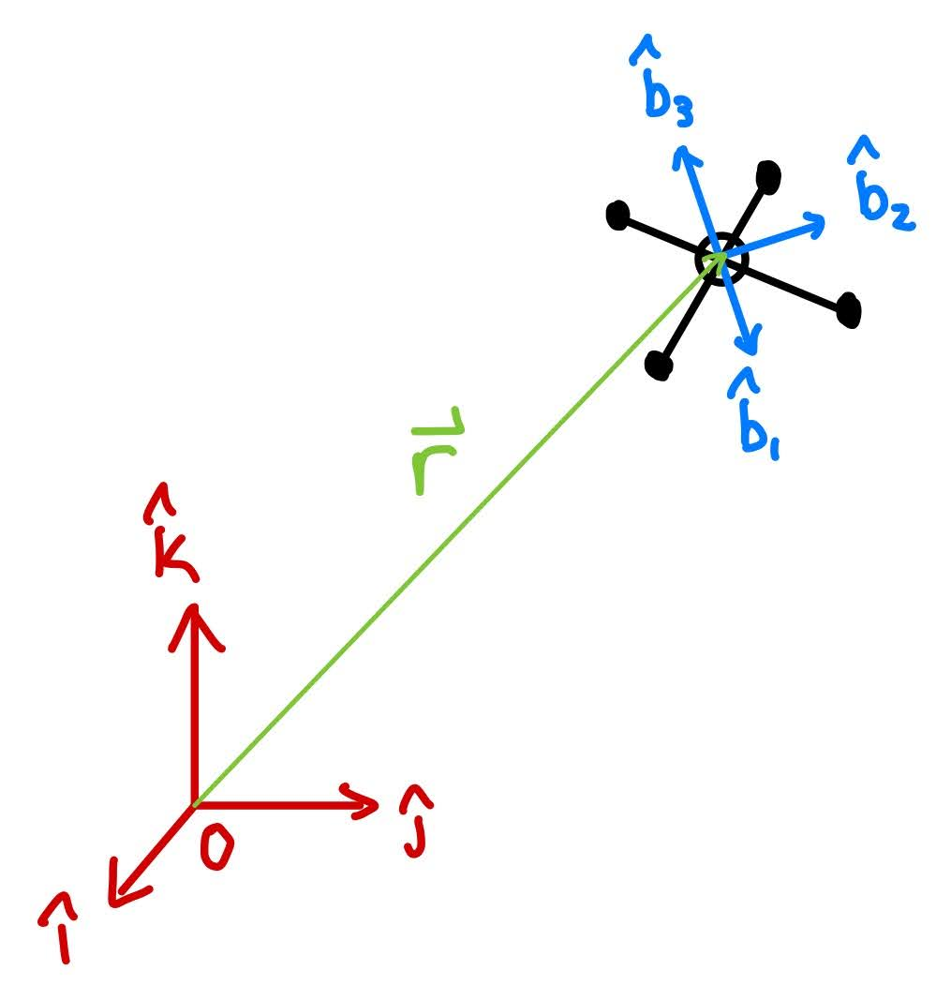
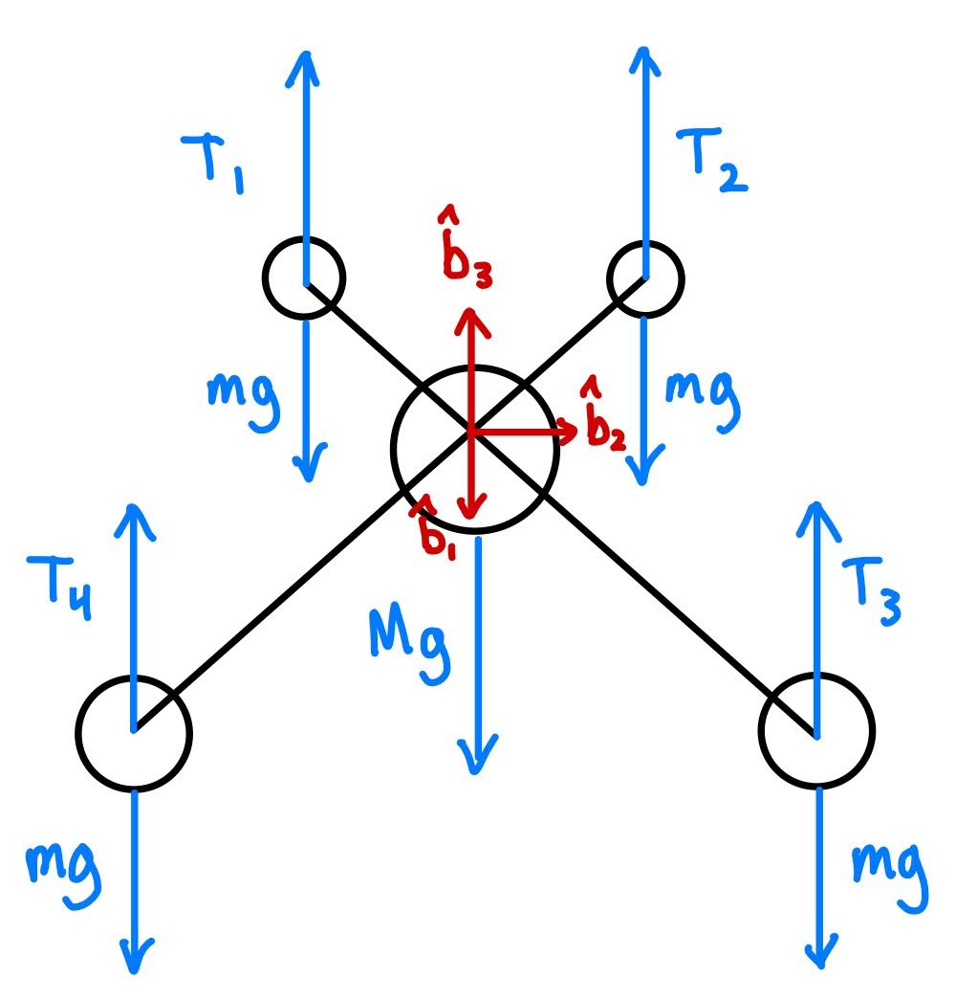
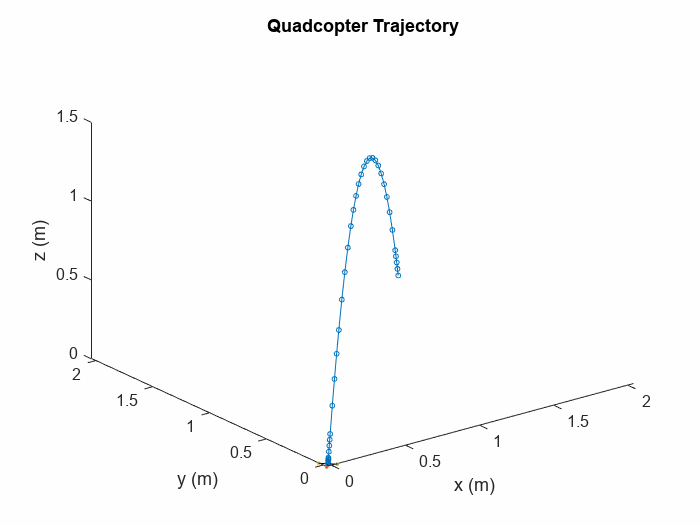
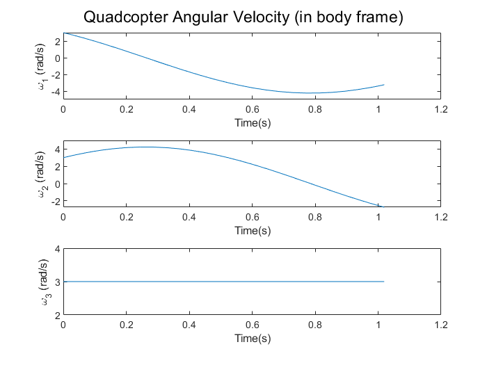
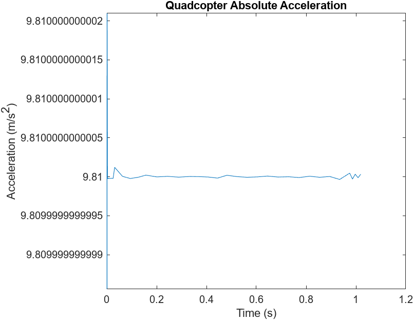

# Modelling and Simulation of a Quadrotor Drone
## Background
Quadrotor drones are a popular and developing technology space. They are used for everything from racing, photography, filmography, package delivery, and industrial and military applications. They are relatively simple to abstract for dynamic analysis due to their symmetrical construction, but also have interesting dynamics due to the thrust forces from the four motors.

## Model
The simulation abstracts the drone as five point masses, one larger one in the center of mass $M$ and four smaller ones of equal mass $m$ at the motors, connected by massless, rigid rods of length $l$ (Fig. 1). The drone has a body fixed frame $b$ with $\hat{b}_1$ pointing towards the front of the drone, $\hat{b}_2$ pointing to the left of the drone, and $\hat{b}_3$ pointing normally out of the top surface of the drone (Fig. 2). The interial frame is defined as the $O$ frame and has unit vectors $\hat{i}$, $\hat{j}$, and $\hat{k}$ (aligned vertically upwards) (Fig. 3). Drag on the body of the drone is neglected and the drone is modeled as being only under the influence of gravitational forces (aligned with $-\hat{k}$) and four thrust forces, one at each motor, aligned with $\hat{b}_3$ (Fig. 4).

**Figure 1.** *Quadrotor Model Diagram. The drone is modeled as five point masses connected by massless, rigid rods.*

**FIgure 2.** *Quadrotor Body-Fixed Frame Diagram. Called the b-frame, it is fixed at the center of the drone and aligned with its front and left.*

**Figure 3.** *Diagram of Inertial and Body Frames. The body frame translates and rotates with respect to the inertial frame as the drone moves.*

**Figure 4.** *Quadrotor Free Body Diagram. Forces acting on the drone are gravity and thrust. Drag on the body of the drone is neglected.*

## Simulation
Equations for all 12 state variables of the system were found using Newton's 2nd Law of Motion and Euler's Equations and Euler's Angle Rate Equations. The 12 state variables used for this simulation are:
* $x, y, z$: Linear Position
* $v_x, v_y, v_z$: Linear Velocity
* $\psi, \theta, \phi$: Angular Position (Euler angles: yaw, pitch, roll)
* $\omega_{b1}, \omega_{b2}, \omega_{b3}$: Angular Velocities (in b-frame)

A write-up of the steps taken to calculate the equations for the 12 state variable derivatives to be used by ODE45 can be found in the [write-up PDF](quadrotor_dynamics_model_writeup.pdf) included in this repository.

A 3-2-1 rotation matrix (yaw, pitch, roll) was used to convert between the inertial and body frames. This is the standard for flying objects like planes and drones. 

The simulation is writen in Matlab in the quadrotor_sim function in the `quadrotor_sim.m` file. The function takes inputs for the four thrust commands and the drone's initial position, velocity, angle, and angular velocity. The physical properties are modeled off of the Crazyflie drone, which is a small, programmable hobby quadrotor. 

The simulation uses the initial conditions and ODE45 to solve the equations of motion for the quadrotor and return its motion over time. An EventStop function stops the simulation if the drone hits the ground. 

## Test Cases
To validate the simulation, a series of test cases was used. The test cases use specific thrusts and initial conditions to test a range of simple and complex situations.

|    | Test Case                            | Thrusts (N)             | Initial Position (m) [x,y,z] | Initial Velocity (m/s) [vx,vy,vz] | Initial Euler Angles (rad) [$\psi$, $\theta$, $\phi$] | Initial Angular Velocity (rad/s) [$\omega_1$,$\omega_2$,$\omega_3$] | Expected Behavior                                                 |
| -- | ------------------------------------ | ----------------------- | ---------------------------- | --------------------------------- | --------------------------------------------- | ------------------------------------------------------- | ----------------------------------------------------------------- |
| 1  | Free Fall                            | 0,0,0,0                 | [0,0,1]                      | [0,0,0]                           | [0,0,0]                                       | [0,0,0]                                                 | Free fall                                                         |
| 2  | Projectile Motion - linear           | 0,0,0,0                 | [0,0,1]                      | [2,2,5]                           | [0,0,0]                                       | [0,0,0]                                                 | Arcs like a regular projectile with no rotations                  |
| 3  | Projectile Motion - linear + angular | 0,0,0,0                 | [0,0,1]                      | [2,2,5]                           | [0,0,0]                                       | [3,3,3]                                                 | Arcs & rotates                                                    |
| 4  | Hover                                | .25mg,.25mg,.25mg,.25mg | [0,0,1]                      | [0,0,0]                           | [0,0,0]                                       | [0,0,0]                                                 | Doesn't move                                                      |
| 5  | Vertical Flight                      | .08,.08,.08,.08         | [0,0,0]                      | [0,0,0]                           | [0,0,0]                                       | [0,0,0]                                                 | Accelerates directly upwards                                      |
| 6  | Horizontal Flight                    | .075,.075,.075,.075     | [0,0,1]                      | [0,0,0]                           | [0,$cos^{-1}(\frac{mg}{4*.075})$,0]                   | [0,0,0]                                                 | Moves horizontally with a constant acceleration                   |
| 7  | 1 Under-powered Motor                | .08,.08,.08,.075        | [0,0,1]                      | [0,0,0]                           | [0,0,0]                                       | [0,0,0]                                                 | Tumbles while going in direction of underpowered motor            |
| 8  | 2 Under-powered Motors - Diagonal    | .08,.075,.08,.075       | [0,0,1]                      | [0,0,0]                           | [0,0,0]                                       | [0,0,0]                                                 | Accelerates upwards, less than regular vertical flight case       |
| 9  | 2 Under-powered Motors - Adjacent    | .08,.08,.075,.075       | [0,0,1]                      | [0,0,0]                           | [0,0,0]                                       | [0,0,0]                                                 | Tilts and goes in direction of underpowered motors and flips over |
| 10 | 3 Under-powered Motors               | .08,.075,.075,.075      | [0,0,1]                      | [0,0,0]                           | [0,0,0]                                       | [0,0,0]                                                 | Corner with higher power motor tilts up, tumbles                  |
| 11 | Motor Dies in Flight                 | .075,.075,.075,0        | [0,0,1]                      | [2,0,0]                           | [0,$cos^{-1}(\frac{mg}{4*.075})$,0]                   | [0,0,0]                                                 | Begins to tumble in direction of dead motor                       |

## Test Results
All simulation tests exhibited expected behavior. Trajectory, velocity, acceleration, angular position, and angular velocity plots are shown below for a few interesting cases.

### Case 3: Projectile Motion - linear + angular
This is the "Throw a drone across the room" case.

|:------------:|:------------:|
|||
